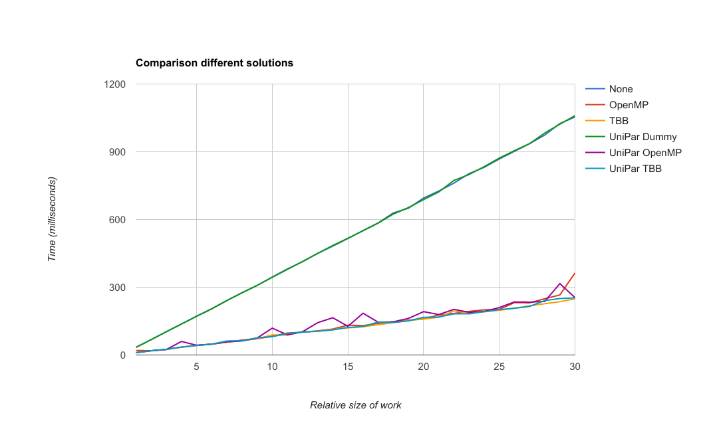

Functionals
===========

Here we'll discuss our progress for each functional requirement.

Population generator
--------------------

We had a rough start, since there was an inconsistency in the assignment. We wrote quite some code for this that was eventually not needed, since the assignment was changed.

After the change, we made reasonable progress and were able to implement all of the requested features. We planned the development of the population generator to be the first thing we did, so that we could use this generator in our tests and further development. We finished quite early in the project on schedule and were able to use it during the development of multi region.

Checkpointing
-------------

Checkpointing was handled in different stages. The first stage was checkpointing the already existing functionality of Stride. This was a clearly seperatable task and we started working on this right away. As HDF5 is a very scientific and broad language, the initial steps were difficult and came with lots of segfaults. However once we got the hang of it the progress of the checkpointing feature went rather smooth. Apart from a few minor adjustments due to constructive criticism, this stage was finished at the alpha demo. The second stage involved handling our own extra features with checkpointing, the major point of struggle was multi region. We had to save all the information of all the different simulators in an efficient way. We also needed to be able to restart a configuration the way it was before. This was a non-trivial matter and we communicated a lot with the different subgroups in the project. After a complete rewrite of the configuration system, which was necessary both for us and for the multi region / mpi tasks this part of the assignment was also finished succesfully.

Last but not least we had to make a trade-off between workload and user experience. It is not possible to restart an entire multi region simulation straight from only one configuration file, more specific we do not save an entire simulation to one file. Therefore the user can restart such a simulation in the exact way it was before, but only using the original configuration file, all other restart options such as timesteps are still available.

ParaView
--------

We considered the ParaView task as a subtask of checkpointing and therefore it's a task for the checkpointing developers. We had trouble with ParaView, from start to end. We started working on ParaView in the middle of the first stage of the checkpointing assignment as we discussed, but we all had trouble compiling or running ParaView let alone using a plugin or writing one ourselves. This in combination with the duplicate way of visualizing using both ParaView and our own visualization tool, led to a tradeoff between functionality for the user and workload for the developers and resulted in us dropping the integration of ParaView.

Multi region
------------

We splitted this in two parts, as described in the assignment.
Our goal here was to make an interface that is designed in such a way, that you wouldn't notice the difference between the shared memory approach and the MPI approach.
This had some serious consequences for the shared memory solution.

The first version was a shared-memory implementation.
We had to rewrite the above mentioned interface 3 times. This was due to some misunderstandings and miscommunications.
We spent lots of time on the design of a good configuration structure, as mentioned before. Once this was decided, the interface of multi region needed a rewrite but the overall development was easier.

As is discussed in our test plan, we were planning to create a unified interface for both our shared-memory implementation and our MPI implementation. This interface, which we called ``AsyncSimulator``, has been (and still is) a point of heavy discussion. It makes extensive use of ``std::future`` to provide the needed parallelism.

We are now working on a prototype for the MPI part of multi region.
This prototype is almost finished but at the moment we only send messages between processes.
The messaging between real life computers is still a work in progress.
Besides this we also need to determine how we use ``std::future`` in this specific situation.

TBB (UniPar)
------------

First, we made a prototype to familiarize ourselves with both OpenMP and TBB. The prototype also showed a small performance increase in favour of TBB. However, a second prototype that was more in line with how OpenMP was used in the main project showed equal performance for both OpenMP and TBB.

We decided to first develop our code for unifying both parallelisation libraries in the prototype. At that point, we also devised a name for our little library: UniPar, short for Unified Parallelisation. It makes extensive use of templates (including parameter packs) and lambda's (including ``std::forward``). In our prototype, performance was identical between the different versions. (The entire table can be found `here <https://docs.google.com/spreadsheets/d/1rCmMDmEkjKxu_n83LOZ5hmwIRmUpV9fPaxiVp4d_rp8/pubhtml?gid=481027622&single=true>`_.)

Then we placed the UniPar library in the main Stride project. This did bring up some issues. The biggest one is the fact that TBB is a bit more high-level than OpenMP. The loop that used OpenMP in Stride, made use of an ``RngHandler``. Those are kept in a vector, one for each thread. This vector is then indexed using ``omp_get_thread_num()``. However, in TBB this function was (as advised by the OpenMP group at Intel) `purposefully removed <https://software.intel.com/en-us/blogs/2008/01/31/abstracting-thread-local-storage>`_. This gave us two options; either provide our own way of getting a thread number in TBB (which would be against TBB's way of working), or devise another way of providing random numbers.

We went with the second option. A ``ResourceManager`` class was added to UniPar (not directly visible for clients). This uses ``std::function`` to provide the requested resource on demand. However, this meant we had to rewrite some stuff in Stride. After multiple tries, we settled on a method without ``RngHandler``, using ``Random`` directly. A new problem showed: although our "Dummy" implementation (without parallelisation) passed all tests, our TBB and OpemMP versions did not. The reason for this is that the previous OpenMP implementation, even though multithreading is inherently nondeterministic, it did however provide "enough" determinism for much narrower limits on the results (i.e. ``getInfectedCount``).

To verify that our implementation wasn't at fault, we tested the original OpenMP implementation with the ``default`` configuration (taken from the tests) on 500 random seeds generated by ``std::random_device`` (very much like our own UniPar implementation). The `results <https://docs.google.com/spreadsheets/d/1yF_mm75vt9aXoNvwnCKWM1m_60lEUh7H60X6p9lEr6o/pubhtml?gid=2007704139&single=true>`_ were as follows (for day 30):

  - Average: 78187
  - Standard deviation: 5983
  - Minimum: 56116 (70000 - 56116 = 13884)
  - Maximum: 108126 (108126 - 70000 = 38126)

This shows us that when using random seeds, we are better off using an expected number of cases of 80000 with a tolerated difference of 30000.

Scientific visualization
------------------------

We have chosen for a lot of technologies to help build our visualization tool. We use `Electron <https://electron.atom.io/>`_ to build a native cross-platform desktop application with web technologies like Javascript and CSS. Electron is able of extracting a buildable executable tool which is what we want for our visualization tool. Due to usage of web technologies we have access to a number of useful libraries. We use 
`Mapbox <https://www.mapbox.com/>`_ for the mapview, `Plotly <https://plot.ly/>`_ for elegant graphs, `AngularJS <https://angularjs.org/>`_ for the dynamic content of our tool and `Material Design Lite <https://getmdl.io/>`_ for the overall styling. Most of these tools were used by at least one of the developers in this subgroup already, so the learning curve was not as steep as it might have been.

The development of the tool is in its final stages, however the layout and design can always be improved, but that's not our top priority of course.

The first presentation of this tool was shown at the beta release, the overall feedback was very positive and the idea of the tool was right. A few adjustments however needed to be done: We added aggregation of different cluster types onto the same location for more information in a less cluttered way. We also added a better overview panel complete with visualized data of our population generator. This last addition guarantees a nice cohesion between different parts of the overall assignment.
